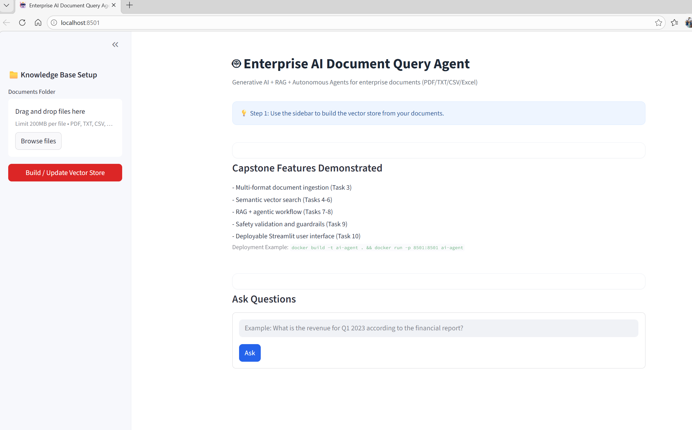
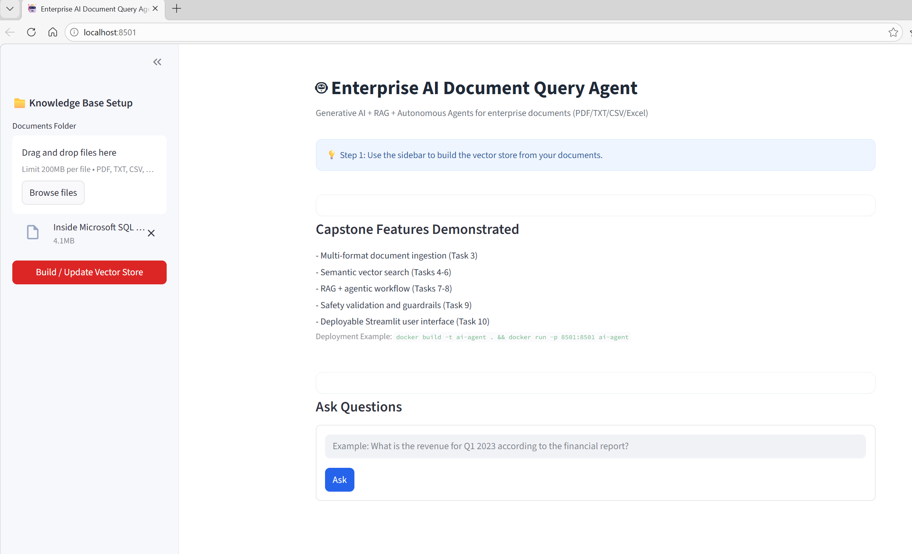
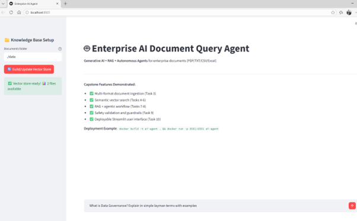
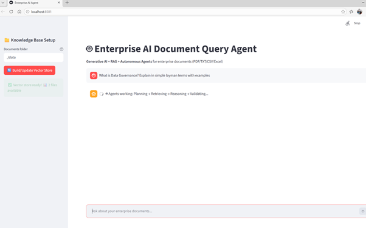
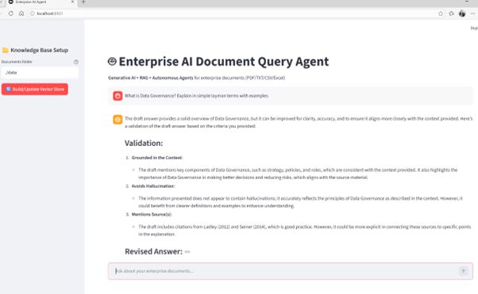
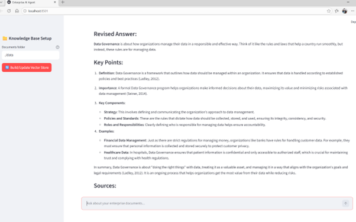
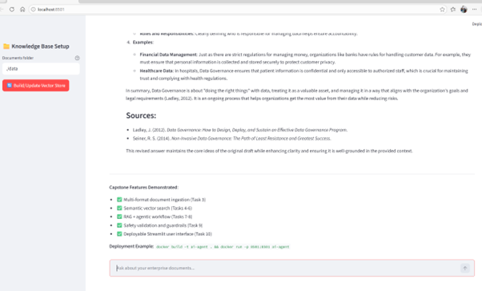

# 🤖 Enterprise AI Document Query Agent

<div align="center">

**Generative AI · Retrieval-Augmented Generation · ChromaDB · Agentic Workflow**

[](https://python.org)
[](https://streamlit.io)
[](https://www.langchain.com)
[](https://www.trychroma.com)
[](LICENSE)

*A capstone project for querying enterprise documents using RAG, semantic vector search, and an agent workflow consisting of Planner → Retriever → Reasoner → Validator.*

</div>

---

## ✨ Features

| Area | Description |
|------|-------------|
| **Document ingestion** | Supports PDF, TXT, CSV, and Excel files and converts them into text |
| **Chunking** | Splits large document text into overlapping chunks for better retrieval |
| **Embeddings** | Uses Hugging Face sentence-transformer embeddings |
| **Vector search** | Stores and searches chunk embeddings using ChromaDB |
| **RAG pipeline** | Combines retrieved chunks with user questions to generate grounded answers |
| **Agent workflow** | Uses Planner, Retriever, Reasoner, and Validator steps |
| **Safety** | Applies output validation to reduce hallucinations and unsafe answers |
| **UI** | Streamlit-based interface for ingestion and question answering |
| **Deployment** | Can run locally or inside Docker |

---

## 📋 Project Overview

This project is developed as part of the **Post Graduate Program in Generative AI and ML Capstone Project**. The objective is to build an AI-powered knowledge and decision support system that can process enterprise documents in multiple formats and answer natural language questions using LLMs, semantic retrieval, and agent-based reasoning.

The application supports:
- Multi-format document ingestion
- Text chunking for semantic search
- Embedding generation
- Vector-based retrieval using ChromaDB
- Retrieval-Augmented Generation (RAG)
- Agent-based planning, reasoning, and validation
- Safety and validation checks
- Streamlit-based user interface

---

## ⚙️ System Setup

### Prerequisites

Before running the application, install the following:

- Python 3.11
- pip
- Git
- Docker (optional)
- OpenAI API key

### Project Structure

```text
enterprise-ai-document-agent/
├── app.py
├── requirements.txt
├── .env
├── README.md
├── Dockerfile
├── src/
│   ├── config.py
│   ├── ingestion.py
│   ├── embedding.py
│   ├── retriever.py
│   ├── agents.py
│   └── safety.py
├── data/
└── chroma_db/
```

### Installation Steps

1. Clone the repository:

```bash
git clone https://github.com/SprawaDeals/enterprise-ai-document-agent.git
cd enterprise-ai-document-agent
```

2. Create and activate a virtual environment:

```bash
python -m venv venv
```

For Windows:

```bash
venv\Scripts\activate
```

For Linux/Mac:

```bash
source venv/bin/activate
```

3. Install dependencies:

```bash
pip install -r requirements.txt
```

4. Create a `.env` file:

```text
OPENAI_API_KEY=your_openai_api_key_here
```

5. Add documents into the `data` folder.

6. Run the application:

```bash
streamlit run app.py
```

7. Open the application:

```text
http://localhost:8501
```

---

## 🏛️ Architecture

The system follows a modular architecture that separates ingestion, retrieval, reasoning, validation, and user interaction.

### High-Level Architecture

```text
User
  |
  v
Streamlit User Interface
  |
  v
Session-Based File Upload
  |
  v
Document Ingestion Layer
(PDF / TXT / CSV / Excel)
  |
  v
Chunking Layer
  |
  v
Embedding Model
(Hugging Face)
  |
  v
Chroma Vector Store
  |
  v
Enterprise Retriever
  |
  v
LangGraph Agent Workflow
(Planner -> Retrieve -> Assess -> Rewrite -> Reason -> Validate -> Fallback)
  |
  v
Validated Response

```

### Architecture Explanation

1. **User Interface Layer**
   - Built using Streamlit.
   - Allows users to select a document folder, build the vector store, and ask questions.

2. **Session-Based Storage**
   - Each Streamlit session gets its own upload folder and vector-store folder.
   - This reduces file overwrite and Windows file-lock issues during repeated indexing.

3. **Document Ingestion Layer**
   - Loads content from PDF, TXT, CSV, and Excel files.
   - Converts all content into text format.

4. **Chunking Layer**
   - Splits large document text into smaller overlapping chunks.
   - Helps preserve context and improve retrieval quality.

5. **Embedding Layer**
   - Uses Hugging Face sentence transformer embeddings.
   - Converts text chunks into dense vector representations.

6. **Vector Store**
   - Uses ChromaDB to store and search embeddings.
   - Supports semantic similarity search.

7. **Retriever**
   - Wraps Chroma retrieval in a custom EnterpriseRetriever.
   - Supports both similarity search and similarity search with scores. 

8. **Agentic Workflow**
   - Built using LangGraph.
   - Includes separate steps for planning, retrieval, context assessment, query rewriting, reasoning, validation, and fallback handling.

9. **Safety Layer**
   - Validates final output.
   - Applies rule-based checks to detect empty output, speculative language, unsafe terms, and missing source attribution.

---

## 🧠 Agent Roles

The system uses a logical agent workflow with separate responsibilities for each stage.

### 1. Planner Agent

The planner agent analyzes the user’s question and identifies:
- the intent of the query
- the key topics involved
- the type of evidence needed from the documents

This improves retrieval accuracy by structuring the query before search.

### 2. Retriever

The retriever performs semantic similarity search over ChromaDB and returns the most relevant document chunks for the given query.

### 3. Context Assessment Node

This step evaluates whether the retrieved context is strong enough to continue. It uses retrieval scores when available and falls back to basic context checks otherwise.

### 4. Query Rewriter Agent

If retrieval quality is weak, the query is rewritten to improve semantic recall before trying retrieval again.

### 5. Reasoner Agent

The reasoner uses:
- the original question
- the retrieval plan
- the retrieved chunks

It generates a draft response using only the available context so that the answer remains grounded in the source documents.

### 6. Validator Agent

The validator checks whether:
- the answer is supported by the retrieved context
- the answer includes references to source content
- the answer avoids unsupported claims or hallucinations

If needed, it rewrites the answer to improve reliability.

### 7. Safety Layer

The safety module applies final checks to the generated output and rejects:
- speculative wording
- unsafe terms
- responses without source grounding

### 8. Fallback Node

If the answer cannot be fully validated after the allowed number of retries, the system returns a fallback response with either:
- a warning plus the draft answer, or
- a generic grounded-failure message.

---

## 🔄 End-to-End Workflow

```text
1. User launches the Streamlit application
2. User uploads enterprise documents in PDF, TXT, CSV, or Excel format
3. Uploaded files are saved into a session-specific folder
4. Documents are loaded and converted into text
5. The text is split into overlapping chunks
6. Embeddings are generated for each chunk
7. Embeddings are stored in a session-specific Chroma vector store
8. User asks a natural language question
9. Planner creates a short retrieval plan
10. Retriever fetches the most relevant chunks
11. Context assessment decides whether retrieval is sufficient
12. If needed, query rewrite improves the search query and retries retrieval
13. Reasoner creates a grounded draft answer
14. Validator approves the answer or requests another retry
15. Safety checks validate the final response
16. The final answer is displayed in the Streamlit UI
```

---

## 🚀 Deployment Steps

### Local Deployment

Run locally using:

```bash
streamlit run app.py
```

Access the application at:

```text
http://localhost:8501
```

### Docker Deployment

Example Dockerfile:

```dockerfile
FROM python:3.11-slim

WORKDIR /app

COPY requirements.txt .
RUN pip install -r requirements.txt

COPY . .

EXPOSE 8501

CMD ["streamlit", "run", "app.py", "--server.port=8501", "--server.address=0.0.0.0"]
```

Build the Docker image:

```bash
docker build -t ai-agent .
```

Run the container:

```bash
docker run -p 8501:8501 --env-file .env ai-agent
```

To persist uploaded data and vector storage:

```bash
docker run -p 8501:8501 -v $(pwd)/data:/app/data -v $(pwd)/chroma_db:/app/chroma_db --env-file .env ai-agent
```

### GitHub Sync

You can version the project on GitHub using:

```bash
git init
git add .
git commit -m "Initial capstone project commit"
git branch -M main
git remote add origin https://github.com/SprawaDeals/enterprise-ai-document-agent.git
git push -u origin main
```

---

## 🖼️ Screenshots

Below are the screenshots from Landing page, indexing the document and providing the search content and finally the results:


<table>
<tr>
<td align="center"></td>
<td align="center"></td>
<td align="center"></td>
</tr>
<tr>
<td align="center"></td>
<td align="center"></td>
<td align="center"></td>
</tr>
<tr>
<td align="center"></td>
<td></td>
<td></td>
</tr>
</table>


---

## 🛠️ Technologies Used

- Python 3.11
- Streamlit
- LangChain OpenAI
- LangGraph
- Hugging Face Embeddings
- ChromaDB
- PyMuPDF
- pandas
- pydantic-settings
- dotenv
- Docker

---

## ✅ Key Features Implemented

- File upload and processing of enterprise documents
- Multi-format support: PDF, TXT, CSV, XLSX
- Text chunking with overlap
- Semantic retrieval from vector database
- Retrieval-Augmented Generation
- LangGraph-based agent workflow
- Query rewrite and retry logic
- Output validation and safety checks
- Streamlit user interface
- Session-specific storage for uploads and vector indexes
- Deployable architecture

---

## ⚠️ Limitations

Although the application works successfully, there are some limitations:

1. **External LLM dependency**
   - The application depends on an external OpenAI model.
   - This introduces API cost and response latency.

2. **Embedding model limitations**
   - The embedding model works best for English text.
   - It may not perform equally well for multilingual or domain-heavy content.

3. **Basic safety validation**
   - The current validation approach is rule-based.
   - It is suitable for demonstration but not as strong as enterprise-grade moderation systems.

4. **Manual vector store refresh**
   - If new documents are added after the vector store has been created, rebuilding may be required.

5. **Single-user design**
   - The Streamlit implementation is suitable for a demo or capstone project.
   - It is not optimized for multi-user production-scale usage.

6. **No access control**
   - Authentication and role-based access control are not currently implemented.

---

## 🧩 Challenges Faced During Development

### 1. LangChain import changes

Several earlier imports were no longer supported in newer LangChain versions. These were updated to the newer module structure such as `langchain_core` and `langchain_huggingface`.

### 2. Pydantic v2 migration

`BaseSettings` moved from `pydantic` to `pydantic_settings`, which caused configuration errors until the import was corrected.

### 3. Chroma persistence changes

The older `persist()` method was no longer available in newer Chroma integrations. The implementation was updated to use `persist_directory`.

### 4. Streamlit session state issues

Session state values such as vector store, retriever, and message history had to be initialized explicitly to avoid runtime errors.

### 5. Agent framework compatibility

Some third-party agent frameworks introduced dependency and import issues. To improve stability, the final design uses a simpler custom agentic workflow with planner, reasoner, and validator steps.

### 6. Chunking and retrieval tuning

Selecting the correct chunk size and overlap required iterative testing to balance context preservation and retrieval precision.

---

## 🔮 Future Enhancements

Possible future improvements include:
- support for more document formats
- direct file upload inside the Streamlit UI
- multi-user authentication
- hybrid retrieval combining vector and keyword search
- local or open-source LLM support
- stronger safety and factual verification
- cloud deployment on Azure, AWS, or GCP

---

## 🧪 Sample Use Case

A user uploads enterprise documents such as DAMA DMBOK, governance files, policy documents, or operational Excel sheets. The user then asks:

```text
What is Data Governance? Explain in simple terms with examples.
```

The system retrieves the most relevant chunks, reasons over them, validates the answer, and presents a grounded response with source-based support.

---

## 🎓 Conclusion

This project demonstrates a complete Generative AI application for enterprise document question answering using RAG and agentic reasoning. It covers document ingestion, vector search, grounded answer generation, validation, and deployment through a usable Streamlit interface.

---

## 👤 Author

Capstone Project Submission  
Post Graduate Program in Generative AI and ML
